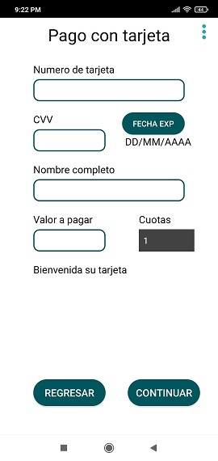
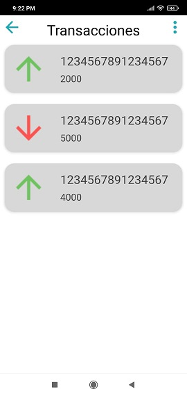

# PruebaWposs
Prueba de seleccion Wposs con transacciones complejas con recyclerview, SQLite, validaciones de tarjetas de credito y dialogos con timers

Esta aplicación permite realizar transacciones como retiros y consignaciones, también permite realizar pagos de servicios o cuotas ya sea en efectivo o con tarjeta de credito con todas las validaciones, implementamos timers para activity actomatizado y diseños personalizados

La app se inicializa con:
Usuario Admin
correo: admin@wposs.com
contraseña: Admin123*

Cliente Jhoan Rangel
tarjeta de credito: 1234567891234567
pin o contraseña: 1209
cedula: 112233
saldo inicial: 5000

